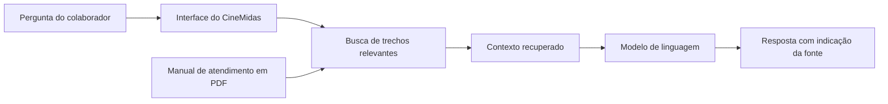

# CineMidas RAG

Agente corporativo baseado em RAG para responder dúvidas frequentes sobre os serviços de uma rede fictícia de cinemas.

> Projeto desenvolvido para o Challenge Alura Agente.

## Status do projeto

Protótipo RAG funcional no Google Colab.

O projeto já processa o manual em PDF, cria embeddings, recupera trechos relevantes, gera respostas com o Gemini e disponibiliza uma interface de chatbot com Gradio.

O deploy na Oracle Cloud Infrastructure ainda está pendente.

## Problema

Colaboradores de uma rede de cinemas precisam consultar diferentes regras para responder dúvidas sobre ingressos, cancelamentos, pagamentos, acessibilidade e outros serviços.

A busca manual por essas informações pode tornar o atendimento demorado e gerar respostas inconsistentes. É visado, também, a diminuição de custos com o atendimento ao cliente online.

## Solução proposta

O CineMidas será um agente de inteligência artificial capaz de responder perguntas utilizando como fonte o Manual de Atendimento da Rede CineViva, uma empresa fictícia criada para este projeto.

A aplicação utilizará uma arquitetura RAG para localizar informações relevantes no documento antes de gerar uma resposta.

## Público-alvo

O agente será destinado aos colaboradores da Rede CineViva, especialmente às equipes de:

- Atendimento ao cliente.
- Bilheteria.
- Bomboniere.
- Suporte digital.
- Operações das unidades.

## Objetivos

- Processar um manual de atendimento em PDF.
- Responder perguntas com base no conteúdo do documento.
- Apresentar respostas claras e objetivas.
- Informar a fonte utilizada na resposta.
- Reconhecer perguntas sem resposta no documento.
- Disponibilizar uma interface online.
- Implantar a aplicação na Oracle Cloud Infrastructure.

## Escopo inicial

O agente poderá responder dúvidas sobre:

- Compra de ingressos.
- Formas de pagamento.
- Meia-entrada.
- Cancelamentos e reembolsos.
- Troca de sessões e assentos.
- Classificação indicativa.
- Acessibilidade.
- Alimentos e bebidas.
- Programa de fidelidade.
- Sessões canceladas.
- Objetos perdidos.
- Canais de atendimento.

## Limitações

O CineMidas não poderá:

- Vender ou cancelar ingressos.
- Consultar pedidos reais.
- Processar pagamentos ou reembolsos.
- Acessar dados pessoais.
- Alterar cadastros.
- Criar regras que não estejam presentes no documento.
- Autorizar exceções às políticas da empresa.

## Arquitetura preliminar

## Exemplos de perguntas e respostas

Os exemplos abaixo foram gerados pelo protótipo funcional.

### Exemplo 1 — Cancelamento de ingresso

**Pergunta:**

> Até quando posso cancelar um ingresso comprado pelo aplicativo?

**Resposta:**

> Ingressos comprados pelo aplicativo podem ser cancelados até duas horas antes do horário de início da sessão. O cancelamento deve ser solicitado pela área “Meus pedidos”.
>
> É possível cancelar apenas alguns ingressos do pedido, desde que o prazo de cancelamento ainda esteja aberto, os ingressos selecionados não tenham sido utilizados e a sessão ainda não tenha começado. Após o limite de duas horas, o cancelamento voluntário não fica disponível.
>
> Fonte: página 4, trecho CV-012.

### Exemplo 2 — Informação inexistente

**Pergunta:**

> Qual será o próximo filme exclusivo produzido pela Rede CineViva?

**Resposta:**

> Não encontrei essa informação no Manual de Atendimento da Rede CineViva. Recomendo encaminhar a dúvida para a equipe responsável.

O segundo exemplo demonstra que o agente foi orientado a não inventar respostas quando o documento não contém informação suficiente.

## Tecnologias utilizadas

- **Python 3:** linguagem principal.
- **Google Colab:** ambiente de desenvolvimento e validação.
- **LangChain:** componentes do fluxo de RAG.
- **PyPDF:** extração do conteúdo do PDF.
- **RecursiveCharacterTextSplitter:** divisão do documento em trechos.
- **Gemini Embedding:** criação das representações semânticas.
- **InMemoryVectorStore:** armazenamento vetorial do protótipo.
- **Gemini 2.5 Flash:** geração das respostas.
- **Gradio:** interface conversacional.
- **Oracle Cloud Infrastructure Compute:** serviço planejado para o deploy.

As credenciais são carregadas por variáveis de ambiente e não são armazenadas no repositório.

As tecnologias poderão ser ajustadas caso os testes revelem problemas de compatibilidade ou implantação.

## Fluxo planejado da aplicação

1. A aplicação carrega o Manual de Atendimento da Rede CineViva em PDF.
2. O texto é extraído e dividido em trechos menores.
3. Cada trecho recebe uma representação semântica.
4. Os trechos são armazenados em uma base vetorial.
5. A pergunta do colaborador é utilizada para localizar os trechos mais relevantes.
6. Os trechos recuperados são enviados ao Gemini como contexto.
7. O Gemini gera uma resposta fundamentada no manual.
8. A interface apresenta a resposta e as fontes consultadas.

## Configuração de credenciais

A chave da API do Gemini deverá ser informada por meio da variável de ambiente:

GEMINI_API_KEY

## Progresso

- [x] Criar o repositório público.
- [x] Definir o problema e o escopo.
- [x] Adicionar o manual em Markdown.
- [x] Revisar e converter o manual para PDF.
- [x] Definir a arquitetura técnica.
- [x] Implementar a leitura do PDF.
- [x] Implementar a divisão do documento.
- [x] Implementar a recuperação de contexto.
- [x] Integrar o modelo Gemini.
- [x] Criar a interface de chatbot.
- [ ] Executar o conjunto completo de validação.
- [ ] Preparar a aplicação para execução fora do Colab.
- [ ] Implantar a aplicação na OCI.
- [ ] Adicionar link e evidências do deploy.
